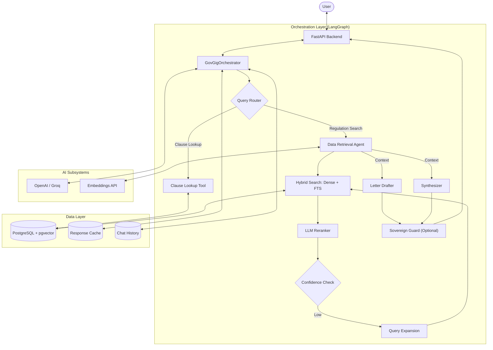

# GovGig AI Engine

GovGig AI is a highly specialized Retrieval-Augmented Generation (RAG) assistant designed for federal contracting compliance. It provides targeted answers, procedural guidance, and document drafting capabilities grounded in federal regulations including the Federal Acquisition Regulation (FAR), Defense Federal Acquisition Regulation Supplement (DFARS), and EM 385-1-1.

The system is built on a scalable Python backend using FastAPI, orchestrated by LangGraph, and persists data securely via PostgreSQL with the `pgvector` extension for high-performance semantic search.

---

## 1. Capabilities

* **Targeted Clause Lookup**: Direct retrieval of specific regulatory clauses (e.g., FAR 52.236-2, DFARS 252.204-7012).
* **Intelligent Regulation Search**: Hybrid retrieval utilizing dense vector embeddings and full-text search, complemented by Reciprocal Rank Fusion (RRF), LLM reranking, and query expansion for robust context retrieval.
* **Automated Document Drafting**: Generates context-grounded letters, Requests for Equitable Adjustment (REAs), and Requests for Information (RFIs).
* **Procedural Synthesis**: Delivers structured, step-by-step guidance for procedural inquiries.
* **Intelligent Routing**: Dynamically routes user intent to specialized sub-agents based on the classification of the request.
* **Production-Ready Features**: Includes JWT-based authentication, user-level rate limiting, caching mechanisms, streaming WebSocket support, and telemetry/feedback persistence.

---

## 2. System Architecture

GovGig AI relies on a modular architecture separating orchestration, intent classification, and data retrieval tasks.



---

## 3. Repository Structure

```text
govgig-feature-python-ai-assistant/
├── src/                        # Core application source
│   ├── agents/                 # LangGraph orchestrator and specialized retrieval agents
│   ├── api/                    # FastAPI application, REST & WebSocket routes, auth middleware
│   ├── db/                     # Connection pooling and PostgreSQL query execution
│   ├── reflection/             # Agent self-healing, critique, and query expansion
│   ├── services/               # Re-ranking logic and safety guardrails
│   ├── state/                  # LangGraph state definitions
│   ├── tools/                  # Vector search utilities and intent classification
│   └── config.py               # Pydantic-based configuration management
├── ingest_python/              # Data ingestion pipeline (PDF parsing, chunking, embedding)
├── dashboard/                  # Streamlit-based diagnostic UI
├── scripts/                    # Maintenance, load testing, and database scripts
├── tests/                      # Pytest unit, integration, and E2E test suites
├── infra/                      # Terraform configurations for AWS deployment
├── Dockerfile                  # Application container definition
├── docker-compose.yml          # Local orchestration environment
└── run.sh                      # Local startup executable
```

---

## 4. Setup and Installation

### Prerequisites
* Python 3.11 or higher
* PostgreSQL 14+ with the `pgvector` extension installed
* An active OpenAI API key for LLM and embedding integrations

### Local Environment Initialization

1. Clone the repository and navigate into the project directory.
2. Prepare a Python virtual environment:
   ```bash
   python3.11 -m venv venv
   source venv/bin/activate
   ```
3. Install dependencies:
   ```bash
   pip install -r src/requirements.txt
   ```
4. Configure environment variables. Duplicate the provided example configuration and update accordingly:
   ```bash
   cp .env.example .env
   ```

### Application Configuration
The platform relies on several key environment variables managed via `src/config.py`.

| Variable | Requirement | Description |
|----------|-------------|-------------|
| `OPENAI_API_KEY` | Required | Key for LLM and embeddings generation. |
| `JWT_SECRET_KEY` | Required | Secure cryptographic key for JWT generation. |
| `PG_HOST`, `PG_PORT` | Optional | Database connection specifics (Defaults: `localhost`, `5432`). |
| `PG_DB`, `PG_USER`, `PG_PASSWORD` | Optional | Database credentials. |
| `RETRIEVAL_TOP_K` | Optional | Base retrieval document limit (Default `12`). |
| `RERANKER_ENABLED` | Optional | Enables post-retrieval LLM re-ranking (Default `true`). |

---

## 5. Usage

To start up the local server, run:

```bash
./run.sh
```
This utility will automatically manage dependencies, perform database health checks, and start the FastAPI service on `http://localhost:8000`.

To start the internal dashboard for testing queries via a UI, run:
```bash
./run_dashboard.sh
```

### Key API Endpoints
The backend primarily operates securely behind JWT authentication. Full interactive documentation is available at `/docs` when the server is running.

| Method | Endpoint | Description |
|--------|----------|-------------|
| **POST** | `/api/v1/auth/signup` | Registers new system users. |
| **POST** | `/api/v1/auth/login` | Authenticates users and generates JWT bearers. |
| **POST** | `/api/v1/query` | The primary entry point for executing natural language intent requests. |
| **GET** | `/api/v1/clause/{ref}` | Deterministic retrieval of a named regulatory clause. |
| **WS** | `/ws/chat` | WebSocket channel for real-time streaming LLM outputs. |

---

## 6. Development and Testing

The repository maintains strict continuous integration standards via `pytest` and `ruff`.

To execute the test suite:
```bash
pytest
```

To run end-to-end integration tests (requires the server to be active):
```bash
python tests/unified_test.py
```

### Data formatting and Linting
To maintain code cleanliness:
```bash
ruff check .
ruff format .
```

---

## 7. Data Ingestion Pipeline

The initial pipeline for processing the text data into vector representations is entirely contained within the `ingest_python/` module. It uses chunking techniques optimized for regulatory texts and stores anchor-enriched data directly into PostgreSQL.

To deploy or update an index namespace:
```bash
bash scripts/index_regulations_v2.sh
```
Update the backend configuration (`REGULATIONS_NAMESPACE=public-regulations-v2`) in your `.env` to switch over to the newly processed vector tables safely without impacting production uptime.

---

## 8. Deployment Architecture

The `infra/` folder maintains our Infrastructure as Code (IaC) via **Terraform**, optimized for AWS.

**Core Infrastructure Highlights:**
* **Compute Layer**: Headless ECS Fargate deployments for the API and Dashboard logic.
* **Storage Layer**: Highly available RDS PostgreSQL instances properly provisioned with `pgvector`.
* **Traffic Management**: Application Load Balancers handling traffic routing and SSL termination.

To provision or alter infrastructure, initialize terraform from the `infra/` directory using your valid AWS provider credentials:
```bash
cd infra/
terraform init -backend-config=backend.hcl
terraform apply
```
