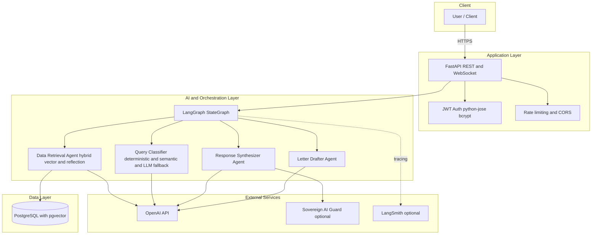
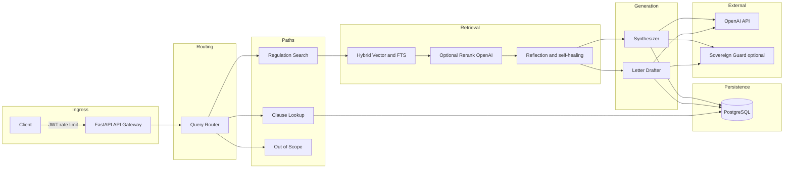

# GovGig AI – Architecture and Environment Reference

**Scope:** Backend AI system and orchestration layer (FedRAMP-relevant boundary). Excludes frontend/UI and cloud deployment; infrastructure will be added when AWS architecture is finalized.

---

## 1. Architecture Diagrams

### 1.1 System Boundary (In-Scope Components)

### 1.2 Request Data Flow

---

## 2. Architecture Narrative

The GovGig AI backend (current scope) consists of:

- **Application layer:** FastAPI (REST and WebSocket), JWT-based authentication (python-jose, bcrypt), rate limiting, and CORS. Requests enter over HTTPS to the API gateway, which validates JWT, applies rate limits, and routes requests.

- **AI / orchestration layer:** LangGraph StateGraph; a multi-layer query classifier (deterministic, then semantic, then LLM fallback); a data retrieval agent with hybrid vector search and reflection-based self-healing; and letter-drafting and response-synthesizer agents (LLM-based).

- **Data layer:** PostgreSQL with pgvector. Tables store embeddings, API cache, users, auth audit logs, chat history, feedback, analytics, and LangGraph checkpoints.

- **External (outbound):** OpenAI (required) for embeddings, response synthesis, letter drafting, reranking, query classifier fallback, and reflection. Optional: Sovereign AI Guard (HTTP POST safety check for generated responses) and LangSmith (tracing and observability for LangGraph).

**Data flow (high level):** Client → FastAPI (JWT, rate limit, route) → Query Router. Router outcomes: *clause lookup* (served from PostgreSQL); *regulation search* (hybrid vector + FTS in pgvector, optional OpenAI rerank, optional reflection, then Letter Drafter or Synthesizer via OpenAI); *out-of-scope* (direct response). Optional post-step: Sovereign Guard. All conversation history, analytics, feedback, and checkpoints are persisted in PostgreSQL. No explicit PII is required to be sent to OpenAI; user identity remains server-side (JWT and DB). Queries and retrieved regulatory chunks are sent for generation; thread identifiers can be used for anonymization if required by policy.

---

## 3. Environment Variables

Source of truth: **Backend** [src/config.py](../src/config.py), **Ingest** [ingest_python/config.py](../ingest_python/config.py). Example values: [.env.example](../.env.example), [infra/terraform.tfvars.example](../infra/terraform.tfvars.example).

| Variable | Used by | Purpose |
|----------|---------|--------|
| **Application / Server** | | |
| APP_NAME | Backend | Application display name. |
| APP_VERSION | Backend | Version string. |
| DEBUG | Backend | Enable debug mode (boolean-like). |
| API_PREFIX | Backend | API path prefix (e.g. /api/v1). |
| HOST | Backend | Server bind host. |
| PORT | Backend | Server bind port. |
| WORKERS | Backend | Number of Uvicorn workers. |
| LOG_LEVEL | Backend | Logging level (e.g. INFO). |
| **OpenAI** | | |
| OPENAI_API_KEY | Backend, Ingest | OpenAI API key; required for embeddings and LLM. |
| MODEL_NAME | Backend | Default LLM model (e.g. gpt-4o-mini) for tool-selector/fallback. |
| EMBEDDING_MODEL | Backend, Ingest | Embedding model (e.g. text-embedding-3-small). |
| TEMPERATURE | Backend | LLM temperature. |
| MAX_TOKENS | Backend | Max tokens per LLM response (optional). |
| **Database** | | |
| PG_HOST | Backend | PostgreSQL host. |
| PG_PORT | Backend | PostgreSQL port. |
| PG_DB | Backend | PostgreSQL database name. |
| PG_USER | Backend | PostgreSQL user. |
| PG_PASSWORD | Backend | PostgreSQL password. |
| PG_SSLMODE | Backend, Ingest | SSL mode (e.g. disable, require). |
| PG_POOL_MIN, PG_POOL_MAX | Backend | Connection pool size. |
| PG_DENSE_TABLE | Backend, Ingest | Table name for dense vector embeddings. |
| PG_SPARSE_TABLE | Backend, Ingest | Table name for sparse embeddings. |
| REGULATIONS_NAMESPACE | Backend, Ingest | Namespace for regulations data (alias NAMESPACE in ingest). |
| DATABASE_URL | Ingest | Full PostgreSQL URL (used by ingest only). |
| **Vector search / RAG** | | |
| DENSE_TOP_K | Backend | Top-K for dense search. |
| SPARSE_TOP_K | Backend | Top-K for sparse search. |
| HYBRID_DENSE_WEIGHT | Backend | Weight for dense in hybrid. |
| HYBRID_SPARSE_WEIGHT | Backend | Weight for sparse in hybrid. |
| RRF_K | Backend | Reciprocal Rank Fusion constant. |
| RERANKER_ENABLED | Backend | Enable LLM reranker (true/false). |
| RERANKER_MODEL | Backend | Model used for reranking. |
| RAG_TOKEN_LIMIT | Backend | Max tokens in RAG context. |
| RETRIEVAL_TOP_K | Backend | Primary retrieval size for regulation_search. |
| REFLECTION_THRESHOLD | Backend | Confidence threshold for self-healing. |
| REFLECTION_HEALING_MARGIN | Backend | Margin to skip borderline retries. |
| SELF_HEALING_SEARCH_K | Backend | Per expanded query search depth. |
| SELF_HEALING_MAX_QUERIES | Backend | Max expanded queries. |
| SELF_HEALING_MAX_DOCS | Backend | Max additional docs from self-healing. |
| MAX_DOC_CHARS_FOR_SYNTHESIS | Backend | Per-document trim before synthesis. |
| SYNTHESIZER_MODEL | Backend | Model for response synthesis. |
| **LangGraph** | | |
| MAX_ITERATIONS | Backend | LangGraph max iterations. |
| RECURSION_LIMIT | Backend | Recursion limit. |
| LANGCHAIN_TRACING_V2 | Backend | Enable LangSmith tracing. |
| LANGCHAIN_API_KEY | Backend | LangSmith API key (optional). |
| LANGCHAIN_PROJECT | Backend | LangSmith project name. |
| **Authentication** | | |
| JWT_SECRET_KEY | Backend | Secret for JWT signing. |
| JWT_ALGORITHM | Backend | JWT algorithm (e.g. HS256). |
| ACCESS_TOKEN_EXPIRE_MINUTES | Backend | Token expiry in minutes. |
| LOGIN_LOCKOUT_MINUTES | Backend | Lockout duration after max failed attempts. |
| LOGIN_MAX_ATTEMPTS | Backend | Max failed login attempts before lockout. |
| RATE_LIMIT_MAX_REQUESTS | Backend | Per-user request limit (query endpoint). |
| RATE_LIMIT_WINDOW_SECONDS | Backend | Rate limit window in seconds. |
| ADMIN_API_KEY | Backend | Optional secret for operational endpoints. |
| COOKIE_SECRET | Backend | Optional secret for session management. |
| **CORS** | | |
| CORS_ORIGINS | Backend | Allowed origins (JSON array or comma-separated). |
| **Sovereign Guard (optional)** | | |
| SOVEREIGN_GUARD_ENABLED | Backend | Enable safety check (true/false). |
| SOVEREIGN_GUARD_BASE_URL | Backend | Guard service base URL. |
| SOVEREIGN_GUARD_DETECT_PATH | Backend | Detect endpoint path. |
| SOVEREIGN_GUARD_TIMEOUT_SECONDS | Backend | Request timeout. |
| SOVEREIGN_GUARD_FAIL_OPEN | Backend | If true, allow response when guard fails. |
| SOVEREIGN_GUARD_BLOCK_MODE | Backend | soft or hard block. |
| SOVEREIGN_GUARD_AUTH_TOKEN | Backend | Optional auth token for guard. |
| **Ingest pipeline** | | |
| EMBEDDING_ENDPOINT | Ingest | Embeddings API endpoint URL. |
| CHUNK_SIZE | Ingest | Chunk size for splitting. |
| CHUNK_OVERLAP | Ingest | Overlap between chunks. |
| MIN_CHUNK_TOKENS | Ingest | Minimum chunk token count. |
| TARGET_CHUNK_MIN_TOKENS | Ingest | Target min tokens per chunk. |
| TARGET_CHUNK_MAX_TOKENS | Ingest | Target max tokens per chunk. |
| CLAUSE_SPLIT_TRIGGER_TOKENS | Ingest | Token threshold to trigger clause split. |
| KEEP_STANDALONE_ANCHOR_CHUNKS | Ingest | Keep standalone anchor chunks (true/false). |
| MAX_CONCURRENT_PDFS | Ingest | Max concurrent PDFs to process. |
| EMBED_RATE_DELAY | Ingest | Delay between embedding calls. |
| BATCH_SIZE | Ingest | Embedding batch size. |
| INCLUDE_FILES | Ingest | File inclusion filter. |
| USE_STEMMING | Ingest | Use stemming for FTS. |
| USE_STOPWORDS | Ingest | Use stopwords for FTS. |
| SPECIFICATIONS_DIR | Ingest | Path to specifications directory. |
| **Dashboard / scripts** | | |
| API_BASE_URL | Dashboard, Scripts | Backend API base URL. |
| DASHBOARD_REQUEST_TIMEOUT | Dashboard | Request timeout in seconds. |
| DASHBOARD_JWT | Dashboard | Optional JWT for dashboard auth. |
| API_TEST_EMAIL | Scripts | Test user email for run_test_queries. |
| API_TEST_PASSWORD | Scripts | Test user password for run_test_queries. |
| **Infra (Terraform)** | | |
| CORE_BASE_URL | .env.example | Staging API reference (e.g. GovGig staging). |
| openai_api_key, jwt_secret_key, admin_api_key, cookie_secret, db_password | Infra | Same as above; passed via Terraform/CI for deployment. |
| cors_origins | Infra | CORS origins for deployed environment. |
